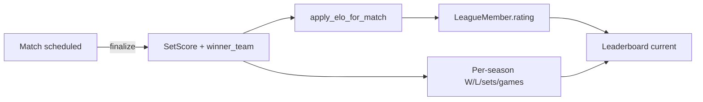

# Padel Tracker

Web app for **multiple leagues**, **seasons**, **invite links**, match scheduling, padel-validated scoring, and **per-league ELO**. Light UI (white + blue). Works on desktop and iPhone (PWA).

## Features

- **Home / leagues** — pick a league after login; pin favourites; rename or delete leagues (as league admin); app admins **Add league**.
- **Join** — request public leagues or accept **invite links** (copy from Members page).
- **Schedule & matches** — per league (`/leagues/{slug}/schedule`); teammates from league roster only.
- **Leaderboard** — per season dropdown; league admins **End season** (soft ELO reset + new season snapshot).
- **Site admin** (`/admin`) — approve accounts; grant **app admin** (can create leagues).
- **League admin** — members, invites, rename/delete league, end season.

## URLs (after login)

| Page | Path |
|------|------|
| Leagues home | `/` |
| Schedule | `/leagues/{slug}/schedule` |
| New match | `/leagues/{slug}/matches/new` |
| Match | `/matches/{id}` |
| Leaderboard | `/leagues/{slug}/leaderboard` |
| Members & invites | `/leagues/{slug}/members` |
| Add league (app admin) | `/leagues/new` |

## Local setup

```bash
cd padel-tracker
python -m venv .venv
# Windows:
.venv\Scripts\activate

pip install -r requirements.txt
copy .env.example .env
# Set SECRET_KEY and ADMIN_EMAIL in .env

alembic upgrade head
uvicorn app.main:app --reload --host 0.0.0.0 --port 8000
```

Open http://localhost:8000

1. Register with `ADMIN_EMAIL` → site admin (can create leagues; default DB also has migrated **Default League**).
2. Approve users at `/admin`.
3. Pin/rename/leagues from `/`; invite players from **Members**; play matches inside a league.

## Data flow (finalize → leaderboard)

When a match is **finalized** on `/matches/{id}`:

1. Set scores are saved and `match.status` becomes `completed`.
2. `apply_elo_for_match` updates each player's `LeagueMember.rating` for that league.
3. The **leaderboard** for the current season reads those ratings (ELO column) and recomputes W–L, set, and game stats from all `completed` matches in that season.

Reopening a match (league or site admin only) reverses the ELO delta and returns the match to `scheduled` so teams and scores can be edited again.



## Match permissions

| Action | Who |
|--------|-----|
| Assign teams (A/B) before finalize | Any active league member |
| Save scores / finalize / change best-of | Match creator, league admin, or site admin |
| Reopen completed match | League admin or site admin only |

## Static HTML demos (layout only)

Open [preview/index.html](preview/index.html) in your browser for **no-server** mocks of the new white/blue layouts.

## Environment variables

| Variable | Description |
|----------|-------------|
| `SECRET_KEY` | Random string for session signing |
| `ADMIN_EMAIL` | Email that becomes site admin on register |
| `DATABASE_URL` | Default `sqlite:///./padel.db` |
| `ELO_K` | ELO K-factor (default 24) |
| `DEFAULT_RATING` | Starting ELO per league member (default 1000) |

## Deploy

Build: `pip install -r requirements.txt && alembic upgrade head`

Start: `uvicorn app.main:app --host 0.0.0.0 --port $PORT`

Set Postgres `DATABASE_URL`, `SECRET_KEY`, `ADMIN_EMAIL` on Render / Fly / Railway.

## Rules

Padel sets: 6-0 … 6-4, 7-5, 7-6 (tiebreak optional for 7-6). Winner: first to `ceil(best_of/2)` sets.

Stack: FastAPI, SQLAlchemy 2, Alembic, Jinja2, HTMX, Tailwind CDN.
